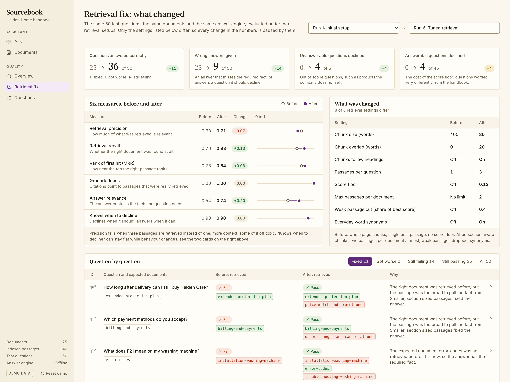
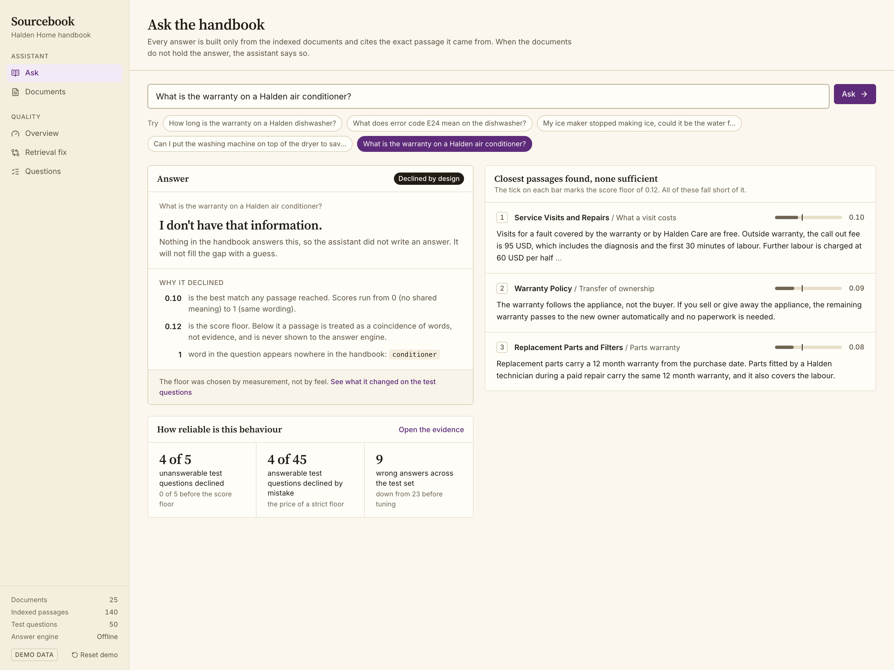
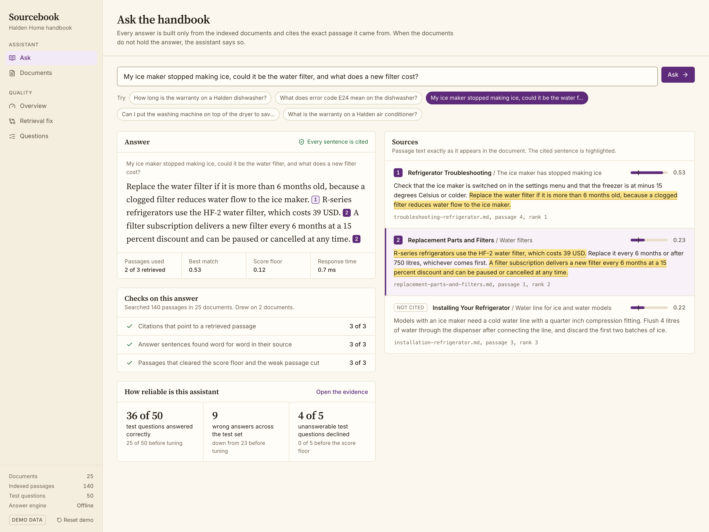
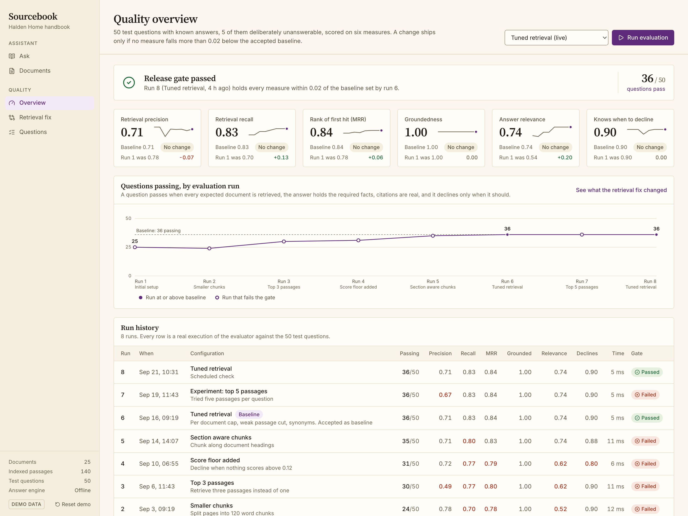
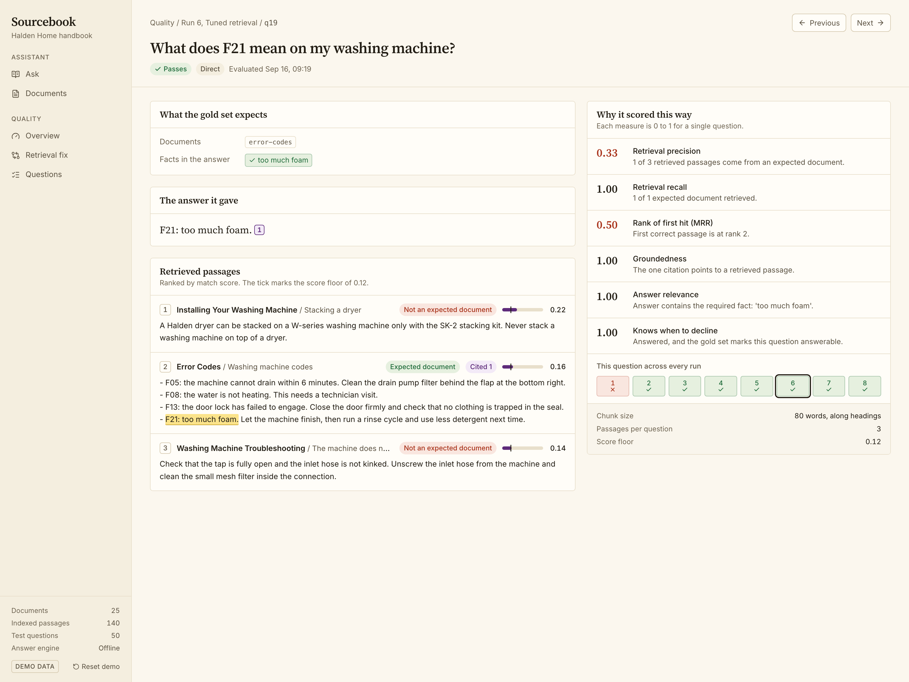
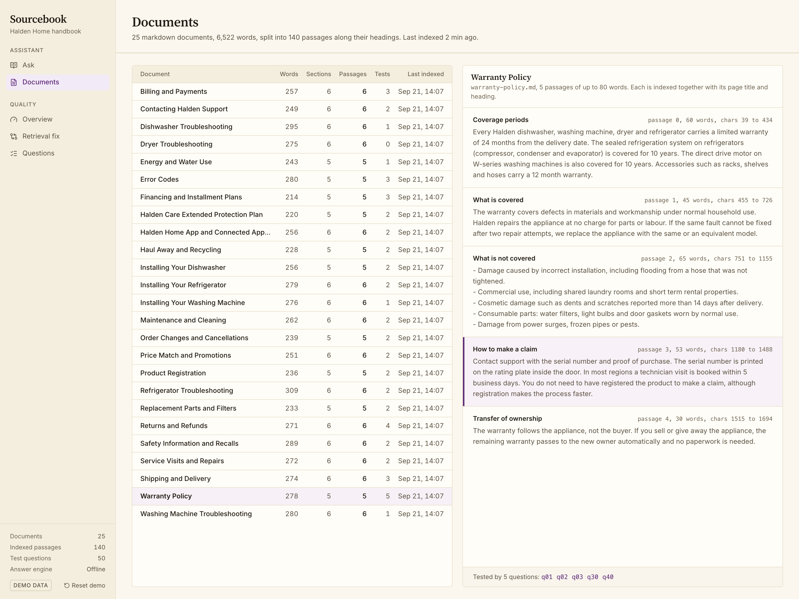

# Sourcebook

**A knowledge base assistant that cites its sources, with a built in quality dashboard.** Python, FastAPI, Claude, React, TypeScript, Tailwind. 15 tests. Runs offline with one command, or in Docker.

A support assistant that answers only from your own documents, shows the exact passage behind every sentence, says "I don't have that information" instead of inventing an answer, and proves with numbers whether a change made it better or worse.



## What it does

Most document chatbots are a chat box and a promise. This one ships with the evidence.

**For the people asking questions**

- **Answers with sources.** Every sentence carries a numbered citation. The panel beside the answer shows the passage word for word, with the cited sentence highlighted, the document, the section and the match score. Click a citation to jump to its passage.
- **Declines instead of guessing.** Ask about a product the handbook does not cover and the assistant replies "I don't have that information", shows the closest passages it found and explains in plain words why none was good enough.
- **A documents screen.** Every indexed document with its passage count and last index time, plus a viewer that shows exactly how it was split.

**For the person responsible for quality**

- **A quality overview.** 50 test questions with known answers, five of them deliberately unanswerable, scored on six measures. A release gate fails when any measure drops more than 0.02 below the accepted baseline. "Run evaluation" executes a real run and adds it to the history.
- **Retrieval fix: what changed.** Two configurations of the same system on the same questions, side by side: the measures, the settings that differ, and every question that flipped from fail to pass with the reason.
- **Question drill down.** For any test question: the expected documents, the retrieved passages with ranks and scores, the answer, and one plain sentence per measure explaining the score.



### The numbers in the demo

All of these are computed at start up by running the evaluator. Nothing is stored or hard coded.

| | Initial setup | Tuned retrieval |
|---|---|---|
| Test questions answered correctly | 25 of 50 | 36 of 50 |
| Wrong answers given | 23 | 9 |
| Unanswerable questions declined | 0 of 5 | 4 of 5 |
| Answerable questions declined by mistake | 0 of 45 | 4 of 45 |
| Retrieval recall | 0.70 | 0.83 |
| Answer relevance | 0.54 | 0.74 |
| Retrieval precision | 0.78 | 0.71 |

The numbers are imperfect on purpose. The offline answer engine is a sentence extractor, not a language model, and ten of the questions are paraphrased or span two documents. Precision goes down because three passages are retrieved instead of one. The point of the product is that you can see all of this.

The demo corpus is a 25 document support handbook for Halden Home, a fictional appliance maker. All data is demo data.

## Screens

| | |
|---|---|
|  |  |
| An answer with numbered citations, and the exact passages highlighted beside it. | Six measures against the accepted baseline, a release gate, and the run history. |
|  |  |
| One test question: expected documents, retrieved passages, and a plain reason for each score. | The indexed handbook, with a viewer that shows how each document was split. |

## Run it

```bash
make demo        # creates .venv, installs, builds the web app, serves everything on http://localhost:8102
```

One process, one port. No API key is needed: the default answer engine is offline and deterministic. State lives in memory and is rebuilt on every start, or from "Reset demo" in the sidebar.

Other ways to run it:

```bash
make test                                   # 15 tests
make dev                                    # API on 8102 with reload, Vite dev server on 5182
docker compose up --build                   # same app in a container on 8102
RAG_EVALS_LIVE=1 ANTHROPIC_API_KEY=... make demo   # Claude writes the answers instead of the extractor
```

Command line, which is what a CI job would call:

```bash
python -m rag_evals run                      # production config, exits 1 on a regression against evals/baseline.json
python -m rag_evals run --config initial     # any preset from rag_evals/config.py
python -m rag_evals run --save               # accept this run as the new baseline
python -m rag_evals ask "Can I keep my fridge in the garage?"
```

### API

| Route | Purpose |
|---|---|
| `POST /api/ask` | Answer a question: numbered answer parts, sources with highlight offsets, closest passages and the decline reason when it abstains |
| `GET /api/docs`, `GET /api/docs/{id}` | The corpus and the chunk viewer |
| `GET /api/runs`, `POST /api/runs` | Evaluation history with gate status; start a real run for a named configuration |
| `GET /api/runs/{id}`, `GET /api/runs/{id}/questions/{qid}` | Per question results and the drill down with explanations |
| `GET /api/compare?before=&after=` | Measure deltas, settings that differ, and per question flips with reasons |
| `POST /api/reset` | Rebuild the demo state |

## Engineering notes

```
docs/*.md ─▶ chunk ─▶ TF-IDF index ─▶ retrieve (with a score floor) ─▶ generate with citations ─▶ score vs gold
```

A RAG system is only as good as the moment you notice it got worse. This repo makes that moment a failing exit code: change the chunk size, swap the embedder, tweak the prompt, run again. If any metric drops more than 0.02 below `evals/baseline.json`, the command exits 1.

### Metrics

| metric | what it catches |
|---|---|
| retrieval_precision | junk passages crowding the context |
| retrieval_recall | the right document never being retrieved |
| mrr | the right passage being buried under wrong ones |
| groundedness | the model citing a passage it was never shown (a fabricated source) |
| relevance | the answer missing the fact the question asked for |
| abstain_correct | answering questions the documents cannot answer (and refusing ones they can) |

A question "passes" in the UI when recall, groundedness, relevance and abstain_correct are all 1.

### What the tuned configuration changes

Each step is a preset in `rag_evals/config.py`, and each is a row in the run history.

1. **Section aware chunks.** Passages never straddle a heading, and each is embedded together with its page title and heading. Passage text stays a verbatim slice of the file (character offsets are kept), which is what makes exact highlighting possible.
2. **Score floor (0.12).** Below it nothing is passed to the generator, so it abstains. Query words the corpus has never seen count toward the query's length, so "warranty on an air conditioner" scores lower than "warranty on a dishwasher".
3. **At most two passages per document**, so a question that spans two documents can reach the second one.
4. **Weak passage cut.** Passages scoring under 40 percent of the best one are dropped.
5. **Synonyms.** A short list in `corpus/handbook/synonyms.json` maps everyday words to the handbook's wording (fridge, washer, guarantee, power strip). Some entries were added after seeing which paraphrased test questions failed, the way a real list grows out of real user queries. Deliberately overfitted entries were left out, which is why several paraphrased questions still fail.

The seeded history is produced by really running every preset at start up. Only the timestamps are staged, spread over three weeks so the history reads like a project. The gold set was used to pick the floor and the cut, so treat the after numbers as tuned on this set, not as a held out estimate.

### Swap parts

- **Embedder**: `TfidfEmbedder` is the default so the harness runs anywhere. Implement `fit`/`embed` for Voyage, OpenAI, or Bedrock Titan and pass it to `Index`.
- **Generator**: `ExtractiveGenerator` (offline) or `AnthropicGenerator`. Any object with `generate(question, passages)` works.
- **Corpus and gold**: drop your markdown in `corpus/handbook/docs`, write `corpus/handbook/gold.jsonl` (`question`, `relevant_docs`, `must_mention`, optional `expect_abstain` and `kind`), run with `--save` to set a baseline. The original four document fixture in `fixtures/` is kept for the unit tests.

### Layout

```
rag_evals/index.py      chunking (word windows or section aware), TF-IDF embedder, search
rag_evals/answer.py     generators, citations, score floor, synonyms
rag_evals/metrics.py    the six metrics
rag_evals/runner.py     run a gold set, compare to a baseline
rag_evals/config.py     named retrieval configurations
rag_evals/explain.py    plain language reasons for scores and flips
rag_evals/service.py    in memory demo state: history, ask, compare
rag_evals/api.py        FastAPI routes, serves web/dist
web/                    React 19, TypeScript, Vite, Tailwind CSS v4
```

The Docker image builds and serves the full app (checked with Docker 29).

MIT.
